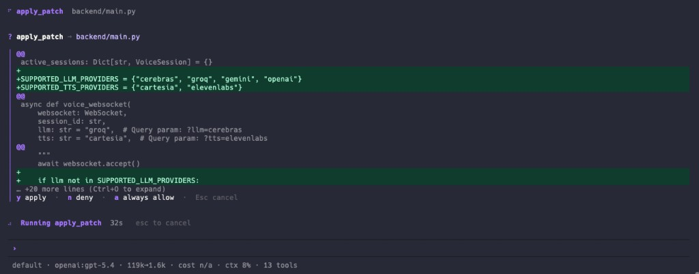
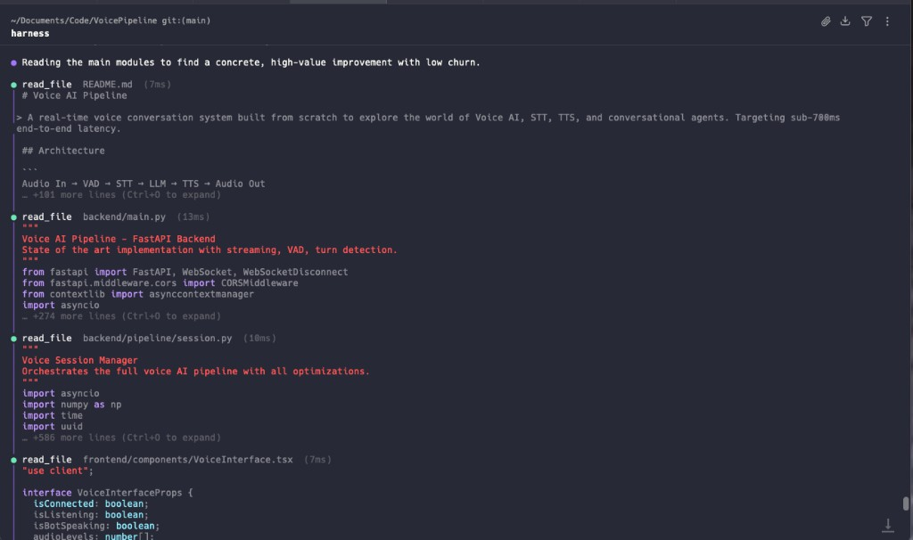
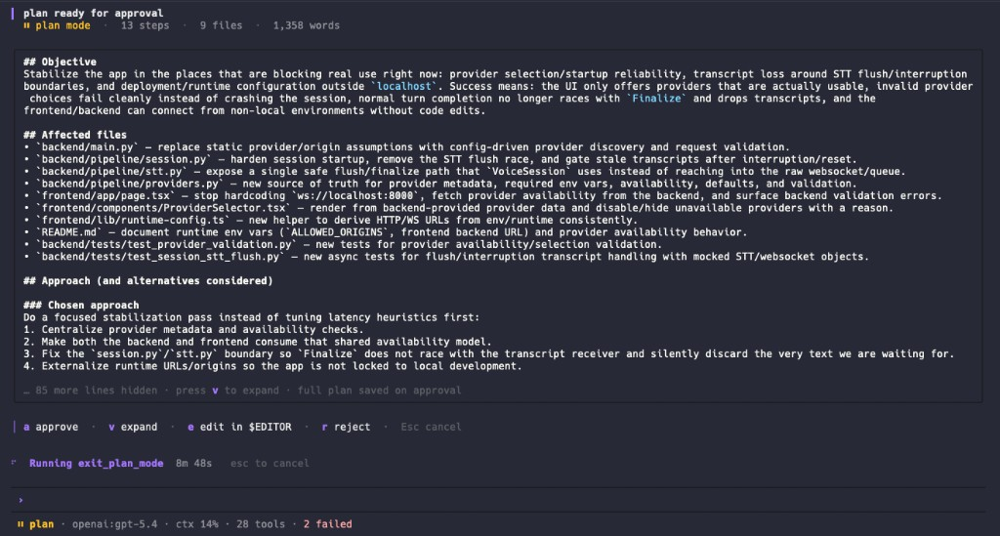
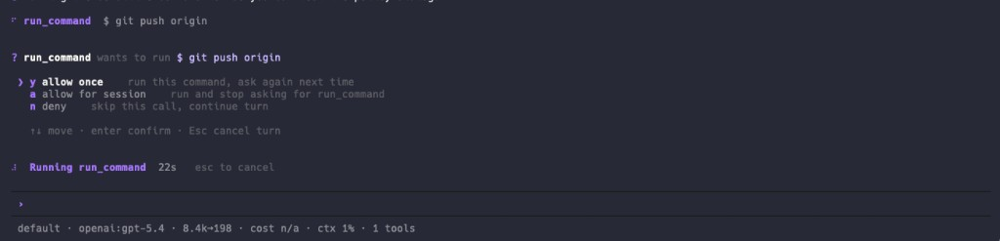
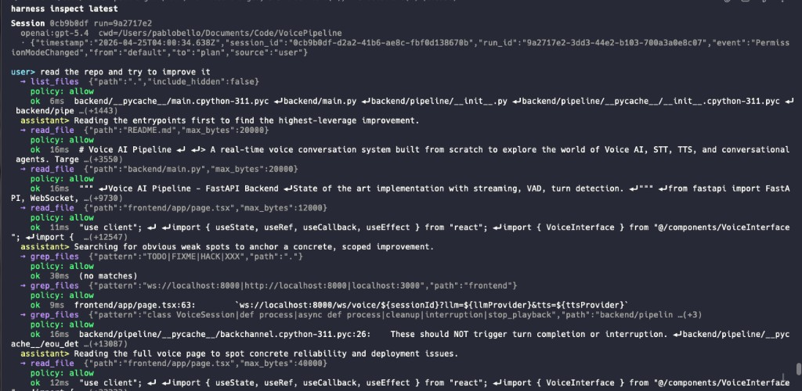
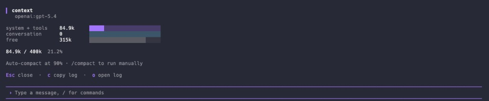
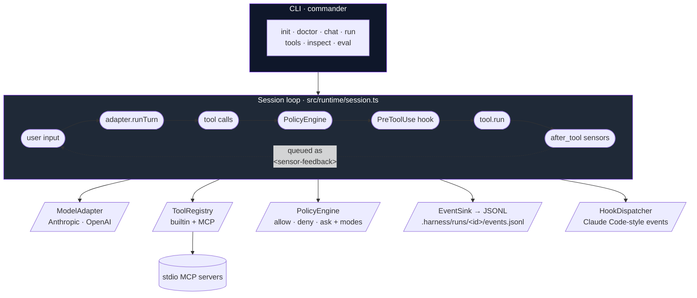

<div align="center">

# harness-lab

**A production-grade coding-agent harness, built from first principles.**

CLI + SDK in TypeScript. The plumbing that turns an LLM into something
you'd let touch a real codebase: explicit context layers, policy-gated
tools, environment sensors, hooks, sub-agents, an MCP client, plan mode,
context compaction, and a deterministic JSONL event log for every run.

[](package.json)
[](tsconfig.json)
[](package.json)
[](LICENSE)
[](tests/)
[](src/adapters)
[](src/mcp)



</div>

> **TL;DR.** The plumbing layer underneath tools like Claude Code or
> Codex CLI — not a wrapper around them. ~10k lines of strict-typed
> TypeScript, 285+ tests, zero LangChain, zero framework magic. Every
> load-bearing decision is documented as an ADR. The whole agent loop
> fits in one file (`src/runtime/session.ts`) and the event log is good
> enough that `harness inspect` can reconstruct any run end-to-end.

---

## Table of contents

- [Why this exists](#why-this-exists)
- [Highlights](#highlights)
- [Screenshots](#screenshots)
- [Architecture in 60 seconds](#architecture-in-60-seconds)
- [Feature tour](#feature-tour)
  - [Provider-agnostic adapters](#1-provider-agnostic-adapters)
  - [Policy engine + permission modes](#2-policy-engine--permission-modes)
  - [Defence-in-depth command execution](#3-defence-in-depth-command-execution)
  - [Plan mode](#4-plan-mode)
  - [Context compaction](#5-context-compaction)
  - [Sensors and hooks](#6-sensors-and-hooks)
  - [MCP client](#7-mcp-client)
  - [Sub-agents](#8-sub-agents-as-context-isolation)
  - [Event log + replay](#9-event-log--replay-tooling)
  - [Ink-based TUI](#10-ink-based-tui)
- [Quickstart](#quickstart)
- [Project layout](#project-layout)
- [Engineering choices worth calling out](#engineering-choices-worth-calling-out)
- [What's deliberately out of scope](#whats-deliberately-out-of-scope)
- [Testing](#testing)
- [License](#license)

---

## Why this exists

Modern coding agents look like magic, but the core is just an LLM, a loop,
and some tools. What separates a production-grade agent from a toy is the
**harness** around it — how context is composed, how tool calls are gated,
how feedback from the environment flows back into the next turn, and how
runs are made observable enough to debug.

This repo is a **learning-by-building** project: I wanted to understand
AI engineering and agent harnesses by reimplementing the load-bearing
primitives myself, from first principles, instead of treating tools like
Claude Code and Codex CLI as black boxes. Small, legible, no framework
magic, every primitive explicit — built so I (and anyone else reading
the code) can answer _why_ those production agents are shaped the way
they are.

The mental model is Martin Fowler's: an agent harness is the engineering
discipline of giving an LLM enough **guides** (instructions, examples,
policy) and **sensors** (signals from the environment) that it can do
useful work without supervision.

| Layer       | What it does                                                 | In this repo                                                                     |
| ----------- | ------------------------------------------------------------ | -------------------------------------------------------------------------------- |
| **Guides**  | feedforward — what the agent is told before it acts          | `system` prompt + `AGENTS.md` + policy rules + hook system messages              |
| **Sensors** | feedback — what the environment tells the agent after acting | `src/sensors/` — typecheck, lint, test (computational); llm-review (inferential) |
| **Loop**    | how guides and sensors compose across turns                  | `src/runtime/session.ts` — the only file you really need to read                 |

Sensor results are injected as `<sensor-feedback>` user messages on the
next turn, so the agent sees its own typecheck failures and can fix them
without human intervention. That's the whole feedback loop.

---

## Highlights

- **One-file agent loop.** The whole turn loop — adapter → text + tool
  calls → policy → hook → tool → result → sensor → next turn — fits in a
  single readable file (`src/runtime/session.ts`). No graph DSL, no
  orchestrator, two nested `while`s and a discriminated union of events.
- **Strict TypeScript, ESM only.** `noUncheckedIndexedAccess`,
  `exactOptionalPropertyTypes`, `verbatimModuleSyntax`. Provider SDK
  types are quarantined to `src/adapters/` — the core never imports
  `@anthropic-ai/sdk` or `openai` directly.
- **Real test suite, zero API calls in CI.** 285+ vitest cases driven by
  a scripted `ModelAdapter` fixture. Unit tests never touch disk outside temp dirs.
  Includes a fixture-based eval harness so the harness can regression-test
  itself.
- **Defence-in-depth `run_command`.** Tokenised with `shell-quote`, split
  on every shell control op, walked through five layered policy stages
  (catastrophic deny → curl-pipe-shell deny → subshell ask → sensitive
  ask → safe-prefix allow), then re-checked against a filesystem-aware
  protected-paths matcher (`~/.ssh`, `*.pem`, `.env*`, …).
- **Persistent shell with crash isolation.** Long-lived `$SHELL` per
  session; commands run inside `( … )` subshells so `exit N` can't kill
  the parent; `cd` survives across calls; output streams live to the TUI;
  foreground commands are auto-promoted to background jobs after 60s.
- **Plan mode that actually plans.** Hard policy enforcement (read-only
  tools), elevated reasoning budget (Anthropic `thinking`, OpenAI
  Responses API auto-routing for `gpt-5*`/`o*` models), prompt contract
  with soft-validation that auto-rejects thin plans before bothering the
  user, and an interactive approval dialog with `$EDITOR` integration.
- **Context-window compaction in two stages.** Observation masking (cheap,
  free-of-charge) replaces stale tool outputs with placeholders;
  LLM summarisation collapses old turns into a markdown block while
  preserving the recent tail byte-for-byte. Pre-compaction snapshots
  are written to disk for recovery.
- **Provider-agnostic by construction.** Anthropic and OpenAI behind one
  `ModelAdapter` interface. The OpenAI adapter auto-routes reasoning-
  family models to `/v1/responses` because `chat.completions` 400s on
  `reasoning_effort` when function tools are present — the kind of edge
  case you only learn by shipping.
- **MCP client.** Connects to stdio MCP servers and registers their tools
  as `mcp__<server>__<tool>` in the same registry as builtins. The model
  doesn't know which is which.
- **Replayable runs.** Every event is appended to
  `.harness/runs/<run-id>/events.jsonl` as a discriminated-union JSON
  object. `harness inspect latest` renders the timeline with totals,
  policy decisions, and sensor outcomes.
- **First-class TUI.** Ink + React. Streaming output, slash commands,
  diff viewer, policy/plan dialogs, `$EDITOR` round-trip, expandable
  tool blocks, status bar with token/cost/context-window indicators.

---

## Screenshots

The TUI is an Ink/React app. Captures from a live session:

|                                                                                                                                                                    |                                                                                                                                            |
| ------------------------------------------------------------------------------------------------------------------------------------------------------------------ | ------------------------------------------------------------------------------------------------------------------------------------------ |
|                                                                                                                    |                                                                                          |
| **Session overview.** Header (model · permission mode · log path), assistant streaming, tool blocks with status badges, status bar with tokens / cost / context %. | **Edit + diff.** `edit_file` / `apply_patch` render an inline unified diff with syntax highlighting.                                       |
|                                                                                                                          |                                                                                          |
| **Plan mode.** `Shift+Tab` toggles into a hard read-only mode with elevated reasoning. The plan goes through soft-validation before the approval dialog opens.     | **Policy prompt.** Sensitive commands route through an `ask` decision. `a` installs a session-scoped allow rule so you're not asked twice. |
|                                                                                                            |                                                                                 |
| **`harness inspect latest`.** Replays `events.jsonl` as a readable timeline with totals and per-tool stats.                                                        | **`/usage`, `/context`, `/status`.** Slash-command overlays with token math, context-window fill, and per-tool counts.                     |

> **Capturing your own:** see [`docs/images/CAPTURE.md`](docs/images/CAPTURE.md)
> for the exact terminal sessions used to produce each shot.

---

## Architecture in 60 seconds



There is no orchestrator, no graph executor, no DAG. Two nested
`while`-loops and a discriminated union of events. Full sequence diagrams
and design notes live in [`docs/architecture.md`](docs/architecture.md).

The four load-bearing decisions — each one capable of derailing the
project if reversed — are written up as short ADRs (Nygard format,
~60 lines each, alternatives and trade-offs included):

- [ADR-001 — Provider adapters, no abstraction framework](docs/adr/001-provider-adapters.md)
- [ADR-002 — Policy as ordered matchers, not a DSL](docs/adr/002-policy-matchers.md)
- [ADR-003 — No LangChain, LangGraph, or Mastra](docs/adr/003-no-langchain.md)
- [ADR-004 — Context as layers, not a single system prompt](docs/adr/004-context-layers.md)

---

## Feature tour

### 1. Provider-agnostic adapters

One `ModelAdapter` interface, two implementations
(`@anthropic-ai/sdk`, `openai`). Provider SDK types never leak past
`src/adapters/`. The OpenAI adapter detects reasoning-family models
(`gpt-5*`, `o1*`, `o3*`, `o4*`, `o5*`) and auto-routes them to the
**Responses API** because `chat.completions` 400s on `reasoning_effort`
when function tools are present — switchable per-call with
`api: "chat" | "responses" | "auto"` (default `"auto"`). Anthropic
plan-mode reasoning translates into `thinking: { type: "enabled",
budget_tokens: 16384 }` with `max_tokens` auto-bumped to satisfy the API.

### 2. Policy engine + permission modes

```ts
type PolicyRule = {
  match: { tool: string | RegExp; pattern?: RegExp };
  decision: "allow" | "deny" | "ask";
  reason?: string;
};
```

Rules evaluated in order, first match wins. `pattern` matches a
tool-specific subject (for `run_command` it's `input.command`; for
others, `JSON.stringify(input)`). Permission modes globally override:

| Internal mode       | CLI value      | Behaviour                                       |
| ------------------- | -------------- | ----------------------------------------------- |
| `default`           | `default`      | Rules apply. `ask` prompts the user (CLI: y/N). |
| `acceptEdits`       | `accept-edits` | `ask` is auto-allowed for write-class tools.    |
| `bypassPermissions` | `bypass`       | Everything except explicit `deny` is allowed.   |
| `plan`              | `plan`         | All non-read tools are short-circuited.         |

`deny` is sticky — `bypassPermissions` won't bypass it. Sticky allow per
`tool::input` from the TUI ("always allow for session") so the user
isn't asked twice.

### 3. Defence-in-depth command execution

`run_command` is the largest blast radius in the harness, so the
implementation is layered:

1. **Segment-based policy.** The legacy "single regex on the raw command"
   approach is trivially bypassed (`echo hi && rm -rf ~`,
   `cat foo | bash`). We tokenise with `shell-quote` and split on every
   shell control op (`;`, `&&`, `||`, `|`, `&`), then walk the parsed
   command in a fixed order:
   1. Catastrophic patterns → hard `deny` (`rm -rf /`, `mkfs.*`,
      `dd of=/dev/sda`, fork bomb, `chmod 777 /`). Cannot be auto-approved.
   2. Remote-fetched script piped to a shell → hard `deny` (`curl … | sh`,
      even via `tee`/`xargs`).
   3. Subshell `$(…)` or backticks → `ask` (we can't statically reason inside).
   4. Sensitive executables → `ask` (`sudo`, `ssh`, `rsync`, `apt`, `brew`,
      `systemctl`, `iptables`, browsers, …).
   5. All segments on the safe-prefix allowlist → auto-`allow`
      (`git status`, `ls`, `pnpm test`, …). Prefix-based so `git status -s`
      is just as safe as `git status`, but `git push` falls through.
   6. Otherwise → `ask`.
2. **Protected paths.** Independent from the policy engine, inspects every
   argv token. Each path is `~`/`$HOME`-expanded, normalised, then matched
   as a path **prefix**. Coverage: `/etc/sudoers`, `/etc/shadow`, `~/.ssh`,
   `~/.aws`, `~/.gnupg`, `~/.kube`, `~/.docker/config.json`, `~/.npmrc`,
   `~/.netrc`, `.git`, `.harness/runs`, plus basename globs `.env*`,
   `*.pem`, `*.key`, `id_rsa`/`id_ed25519`/…
3. **Persistent shell.** Long-lived `$SHELL` per session
   (`src/tools/persistent-shell.ts`). Each command runs inside a subshell
   `( … )` so `exit N` can't kill the parent; `trap "pwd > …" EXIT`
   captures the cwd no matter how the subshell terminates. Result: `cd`
   survives across calls, but `export` does not (assignment happens in the
   subshell). We accept losing env-var persistence to gain crash-resistance.
4. **Streaming output.** Tools receive an optional `ctx.emitOutput(chunk)`
   callback; the session forwards each chunk as a `ToolOutputDelta` event;
   the Ink UI swaps the "final output" view for a live `StreamingOutput`
   component while the tool is `running`. Buffer is capped so a chatty
   server can't blow up state.
5. **Auto-backgrounding.** Foreground commands crossing
   `auto_background_after_ms` (default 60s) are transparently promoted to a
   background job — the tool returns a `job_id` and the model polls
   progress with `job_output`. Jobs explicitly started in the background
   go through a 1s **fast-failure window** so commands that die
   immediately surface as normal failures instead of opaque job ids.

### 4. Plan mode

A read-only deliberation mode for large / ambiguous tasks. `Shift+Tab`
toggles in the TUI; `--permission-mode plan` starts a session there.
Three levers pull at once:

1. **Hard enforcement.** `PolicyEngine` denies every tool whose
   `risk !== "read"`. The model cannot write or execute, even if it tries.
2. **Elevated reasoning budget.** Auto-injects `reasoning: { effort: "high" }`
   into every turn. Anthropic → `thinking` budget; OpenAI → routed to
   Responses API for reasoning models.
3. **Prompt contract.** A system reminder mandates ≥3 read-only tool calls
   before `exit_plan_mode` and spells out the required plan shape
   (Objective · Affected files · Approach + alternatives · Steps · Risks ·
   Verification). `exit_plan_mode` runs soft-validation (word count, file
   refs, step count, section signals) and **auto-rejects thin plans**
   before bothering the user — the model reads the rejection as a tool
   result and iterates.

The approval dialog supports `a`pprove (writes
`.harness/plans/<ts>-<slug>.md`), `v` expand/collapse, `e` edit in
`$EDITOR` (Ink raw-mode released so the editor owns the TTY), or
`r`eject with free-text feedback.

### 5. Context compaction

Two complementary techniques run in sequence
(`src/runtime/compactor.ts`):

1. **Observation masking** (JetBrains Junie pattern). Stale tool-result
   messages are replaced with a placeholder while the tool _call_ stays
   visible — the model still knows what it did. Tool outputs account for
   60–80% of long-session context, so this alone frees most of it for
   free.
2. **LLM summarisation** (OpenCode / Claude Code pattern). Everything but
   the tail (`keepLastNTurns` messages) is sent to the adapter with a
   summariser prompt. The returned markdown block replaces the summarised
   region. The tail is preserved byte-for-byte so file paths and recent
   error messages stay intact.

Before any of this runs, a full snapshot of the pre-compaction
conversation is written to disk so a human (or the agent) can recover
detail the summary omitted.

### 6. Sensors and hooks

**Sensors** are signals from the environment, injected as
`<sensor-feedback>` user messages on the next turn:

- **Computational** (cheap, deterministic) — `tsc --noEmit`, `eslint`,
  `vitest`. Auto-skip when the relevant config file is missing.
- **Inferential** — `llm-review` ships as a stub; charged per token,
  default-disabled.

Triggers: `after_tool` (per tool result), `after_turn` (post assistant
message with no tool call), `final` (`SessionEnd`).

**Hooks** mirror Claude Code's vocabulary so on-disk traces and hook
handlers share names: `SessionStart`, `UserPromptSubmit`, `PreToolUse`
(blockable), `PostToolUse`, `PostToolUseFailure`, `SubagentStart/Stop`,
`Stop`, `PreCompact`, `PostCompact`, `SessionEnd`.

### 7. MCP client

`src/mcp/client.ts` connects to stdio MCP servers declared in
`harness.config.mjs` and registers each remote tool as
`mcp__<server>__<tool>` in the same `ToolRegistry` as builtins. The model
doesn't know which is which, and the same policy engine gates both.

### 8. Sub-agents as context isolation

The `subagent` tool spawns a fresh `runSession` with:

- The same `adapter`, `sink`, `policy`, `hooks` (events stay in the same
  log; policy stays consistent).
- A **filtered** registry: `subagent` itself is removed (no recursion);
  `allowedTools` further narrows the child's surface.
- A fresh `messages[]` — the child sees only its `prompt`, no parent
  context.
- `subagentDepth + 1`. Default `maxSubagentDepth = 1` means parents may
  spawn but children may not.
- No sensors — typechecking inside every subagent is wasteful duplication.

The child runs to `end_turn` and its last assistant message becomes the
parent's tool result. Delegate a noisy subtask, get back a clean string.

### 9. Event log + replay tooling

Every meaningful runtime moment is appended to
`.harness/runs/<run-id>/events.jsonl` as a single JSON line. The schema
is a discriminated union (`src/runtime/events.ts`); field names mirror
Claude Code's hook payloads (snake_case + `event` key) so on-disk traces
and hook handlers share a vocabulary.

`harness inspect [run-id|latest]` parses the file back and renders a
readable timeline with totals, policy decisions, and sensor outcomes.
The same file is enough to reconstruct the conversation, audit policy
decisions, and bisect sensor regressions.

### 10. Ink-based TUI

`src/cli/ui/` is a small Ink + React app:

- Streaming assistant text and streaming tool output (live tail of the
  current command).
- Inline unified diff viewer for `edit_file` / `apply_patch`, with
  syntax-highlighted before/after.
- Policy and plan-approval dialogs with hotkeys; `$EDITOR` round-trip
  for the plan dialog (Ink raw-mode released so the editor owns the TTY).
- Slash commands: `/help`, `/status`, `/model`, `/tools`, `/details`,
  `/log`, `/usage`, `/context`, `/compact [focus on X]`, `/clear`,
  `/exit`. Tab-completion in the prompt.
- Status bar with permission mode, model, tokens (`in→out`, compact
  formatting), cost (when pricing is known), context-window fill % with
  warn/critical thresholds, tool counts and failure counts, compaction
  indicator.
- Keymap: `Shift+Tab` toggles plan ↔ default; `Ctrl+O` expands the
  focused tool block; `Ctrl+]` cycles the focused tool; `Esc` cancels
  the current turn; `Ctrl+C` twice to exit.

---

## Quickstart

```bash
pnpm install
pnpm build

export ANTHROPIC_API_KEY=sk-ant-...
# or
export OPENAI_API_KEY=sk-...

# Try it on a throwaway project
mkdir /tmp/demo && cd /tmp/demo
node /path/to/harness-lab/dist/cli/main.js init       # scaffold harness.config.mjs + AGENTS.md
node /path/to/harness-lab/dist/cli/main.js doctor     # check node + API keys + write perms
node /path/to/harness-lab/dist/cli/main.js run \
  "create fizzbuzz.js for 1..15, then run it with node and show me the output"
node /path/to/harness-lab/dist/cli/main.js inspect latest
```

Or interactively:

```bash
harness                                  # default: chat TUI
harness --permission-mode plan           # start in plan mode
harness chat --model claude-sonnet-4-5
harness eval examples/fixtures/*.json    # regression-test the harness itself
```

`harness eval` expects the shell to expand wildcards; quote the paths only
when you want to pass explicit filenames.

For development:

```bash
pnpm test            # unit + integration (285+ tests, no network)
pnpm typecheck       # strict tsc --noEmit
pnpm lint            # eslint (flat config)
pnpm format          # prettier
```

---

## Project layout

```
src/
  runtime/      session loop, events, cost, context window,
                compaction, plan-mode prompts, background jobs,
                workspace confinement, protected paths, control channel
  adapters/     anthropic + openai (auto chat/responses routing)
  tools/        read · list · grep · edit · apply-patch · run-command
                · job-output · job-kill · subagent · exit-plan-mode
                + command-parser + persistent-shell
  policy/       engine, defaults, run-command-policy (segment-based)
  hooks/        Claude Code-style dispatcher
  sensors/      typecheck · lint · test · llm-review (stub)
  mcp/          stdio MCP client
  config/       harness.config loader, AGENTS.md resolver
  cli/          init · doctor · chat · run · tools · inspect · eval
                + ui/ (Ink + React TUI)
docs/
  architecture.md   long-form sequence diagrams + design rationale
  adr/              short ADRs for load-bearing decisions
  images/           screenshots referenced from this README
examples/
  fixtures/         eval-harness fixtures
tests/              vitest — one file per module, 285+ cases
```

---

## Engineering choices worth calling out

The calls that are most non-obvious from the outside:

- **`exit_plan_mode` is `risk: "read"`, not `"write"`.** The file write
  is gated by the user-facing approval dialog, not by the policy engine,
  so in a non-interactive runtime the tool fails fast instead of writing
  without consent.
- **Sensitive commands `ask` instead of `deny`.** The previous default
  was deny-by-banlist, which led to silent failures the model couldn't
  recover from. Asking the user is a recoverable failure mode; failing
  closed is not.
- **Persistent shell trades env-var persistence for crash-resistance.**
  Each command runs inside `( … )` so `exit N` can't kill the parent
  shell, but that means `export` doesn't persist. Worth it.
- **Sensors don't interrupt the loop mid-turn.** They queue feedback
  that's prepended as a user message at the _next_ model call, keeping
  the conversation transcript well-formed.
- **Sub-agents are context isolation, not orchestration.** No graphs, no
  shared blackboards. The child returns a string; the parent never sees
  intermediate steps.
- **TypeScript configs are intentionally not runtime-loaded by the CLI.**
  Use the SDK directly or ship JavaScript config. This avoids dragging
  `tsx`/`ts-node` into the runtime path.

---

## What's deliberately out of scope

- LangChain / LangGraph / Mastra. Direct adapters only (see ADR-003 above).
- OS-level sandboxing (`sandbox-exec` on macOS, `bubblewrap`/`firejail`
  on Linux, container wrapping). The soft layers above already deny the
  obviously-bad shapes; sandboxing will plug in as an optional
  `runner: "sandbox" | "container"` per-tool setting without changing
  the policy contract.
- MCP server host. We're a client only.
- Multi-agent orchestration. One level of sub-agent, no graphs, no
  shared blackboards.
- Persistent semantic memory across sessions. The `.harness/runs/` log
  is the source of truth.
- Automatic cost cap. Token totals are tracked; enforcement is the
  caller's job for v0.

---

## Testing

- **Scripted `ModelAdapter` test fixture** for integration tests — no API
  calls in CI, ever.
- Tests in `tests/` mirror `src/` structure (one file per module).
- Unit tests never hit disk outside of temp dirs.
- A fixture-based eval harness (`examples/fixtures/*.json`) lets the
  harness regression-test itself: each fixture declares a task plus
  assertions (files exist, substrings, exit code, max tool calls).

```bash
pnpm test                                  # full suite
pnpm test runtime/session                  # filter by path
pnpm test:watch                            # vitest watch mode
```

---

## License

MIT — see [`LICENSE`](LICENSE).
